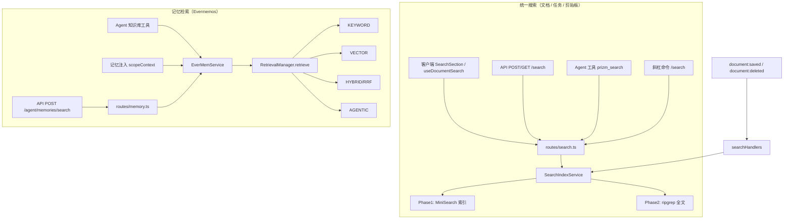
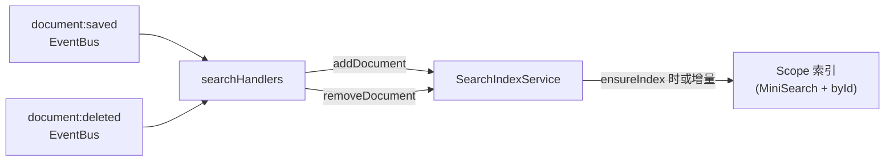
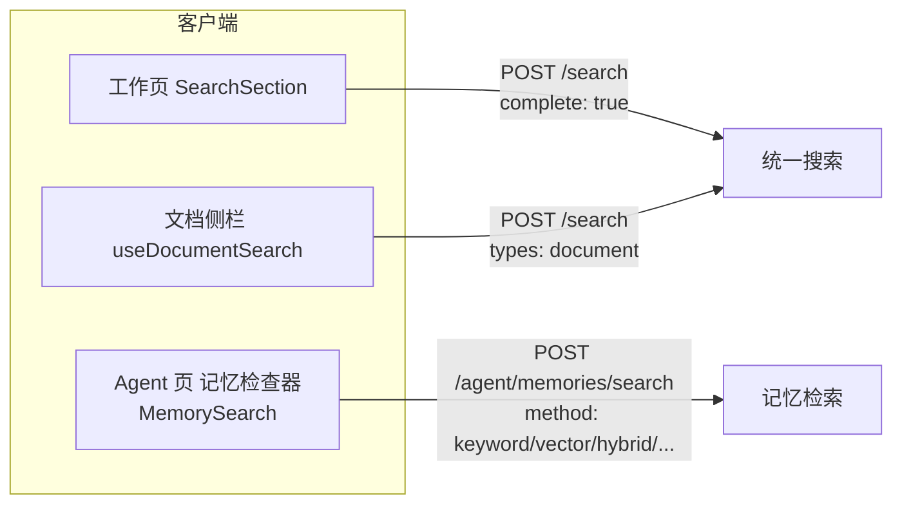

# Prizm 搜索逻辑图

本文档描述所有与搜索相关的入口、路由、服务与数据流。

---

## 1. 总览：两套独立搜索体系



- **统一搜索**：只做关键词/全文匹配，数据来自 scope 下的文档、待办、剪贴板；**不含向量**。
- **记忆检索**：可选 KEYWORD / VECTOR / HYBRID 等，数据来自记忆库（SQLite + LanceDB），**含向量与混合检索**。

---

## 2. 统一搜索（文档 / 任务 / 剪贴板）详细流

```mermaid
flowchart LR
  subgraph 入口
    Client[Electron: SearchSection\nuseDocumentSearch]
    API[POST /search\nGET /search?q=]
    Tool[Agent: prizm_search]
    Slash["斜杠: /search &lt;关键词&gt;"]
  end

  subgraph 服务端
    Routes["routes/search.ts\n(scope, keywords, types,\nlimit, mode, fuzzy, complete)"]
    SIS["SearchIndexService\n.search(scope, keywords, options)"]
  end

  Client --> |http.search(complete:true)| API
  API --> Routes
  Tool --> |getSearchIndexForTools()| SIS
  Slash --> |getSearchIndexForTools()| SIS
  Routes --> SIS

  subgraph SearchIndexService 内部
    parse[parseKeywords]
    ensure[ensureIndex 懒加载索引]
    P1["Phase 1: MiniSearch\nidx.miniSearch.search()\n→ source: 'index'"]
    P2["Phase 2: 仅 complete=true\nripgrepSearch(scopeRoot, *.md)\n→ source: 'fulltext'"]
    merge[合并去重、按 score 排序]
    slice[slice(0, limit)]
  end

  SIS --> parse --> ensure --> P1 --> merge
  P1 --> matchedIds
  P2 --> matchedIds
  matchedIds[matchedIds 去重] --> P2
  merge --> slice --> 结果["results[]\n{ kind, id, score, source, ... }"]
```

### 2.1 统一搜索索引的更新（写路径）



- 仅**文档**的创建/更新/删除会驱动搜索索引更新；待办、剪贴板在 **ensureIndex** 时从 adapters 全量加载进索引。

---

## 3. 记忆检索详细流

```mermaid
flowchart TB
  subgraph 入口
    MemAPI["POST /agent/memories/search\n(query, method, use_rerank, limit, memory_types)"]
    Knowledge[Agent 知识库工具\nprizm_knowledge search 等]
    Inject[记忆注入\nscopeContext / 对话轮]
  end

  MemAPI --> MemRoutes[routes/memory.ts]
  MemRoutes --> searchMemoriesWithOptions[searchMemoriesWithOptions]
  Knowledge --> searchScopeMemories / searchUserMemories 等
  Inject --> searchThreeLevelMemories / searchUserAndScopeMemories

  searchMemoriesWithOptions --> doSearchWithManager
  searchScopeMemories --> doSearchWithManager
  searchUserMemories --> doSearchWithManager
  searchThreeLevelMemories --> doSearchWithManager

  doSearchWithManager["doSearchWithManager\n(retrieval, query, user_id, group_id, options)"]
  doSearchWithManager --> Retrieve["RetrievalManager.retrieve(request)"]

  subgraph Retrieve 分支
    method{method}
    method --> |KEYWORD| KW[keywordSearch]
    method --> |VECTOR| VS[vectorSearch]
    method --> |HYBRID / RRF| HS[hybridSearch]
    method --> |AGENTIC| AS[agenticSearch]
  end

  KW --> ["SQLite 候选\n+ MiniSearch 打分\n或 fallbackLikeScore"]
  VS --> ["getEmbedding(query)\n+ storage.vector.search\n(LanceDB)"]
  HS --> ["Promise.all\nkeywordSearch + vectorSearch\n→ RRF 融合"]
  AS --> ["LLM 查询扩展\n→ 多路 hybrid\n→ RRF 融合"]

  Retrieve --> rerank{use_rerank?}
  rerank --> |是| Rerank[applyRerank]
  rerank --> |否| 结果
  Rerank --> 结果[MemoryItem[]]
```

### 3.1 记忆检索方法对照

| method     | 实现           | 数据/存储              |
|-----------|----------------|------------------------|
| KEYWORD   | keywordSearch  | SQLite 候选 + MiniSearch 打分 |
| VECTOR    | vectorSearch   | getEmbedding + LanceDB 向量搜索 |
| HYBRID/RRF| hybridSearch   | 并行 KEYWORD + VECTOR，RRF 融合 |
| AGENTIC   | agenticSearch  | LLM 扩展 query → 多路 hybrid → RRF |

---

## 4. 客户端入口与 API 对应关系



---

## 5. 文件与职责速查

| 模块 | 文件 | 职责 |
|------|------|------|
| 统一搜索路由 | `prizm/src/routes/search.ts` | POST/GET /search，调 SearchIndexService |
| 统一搜索核心 | `prizm/src/search/searchIndexService.ts` | MiniSearch + ripgrep，source: index/fulltext |
| 关键词解析 | `prizm/src/search/keywordSearch.ts` | parseKeywords, cjkTokenize |
| 全文扫描 | `prizm/src/search/ripgrepSearch.ts` | ripgrep *.md |
| 索引事件 | `prizm/src/core/eventBus/handlers/searchHandlers.ts` | document:saved/deleted → 更新索引 |
| Agent 搜索工具 | `prizm/src/llm/builtinTools/searchTools.ts` | prizm_search → SearchIndexService |
| 斜杠命令 | `prizm/src/llm/slashCommands.ts` | /search → SearchIndexService |
| 记忆路由 | `prizm/src/routes/memory.ts` | POST /agent/memories/search |
| 记忆检索封装 | `prizm/src/llm/EverMemService/search.ts` | searchMemoriesWithOptions, doSearchWithManager |
| 记忆检索实现 | `packages/evermemos/src/core/RetrievalManager.ts` | KEYWORD/VECTOR/HYBRID/AGENTIC |
| 知识库工具 | `prizm/src/llm/builtinTools/knowledgeTools.ts` | 知识库搜索 → searchScopeMemories 等 |
| 客户端全局搜索 | `prizm-electron-client/src/components/SearchSection.tsx` | 工作页搜索框，POST /search |
| 客户端文档搜索 | `prizm-electron-client/src/hooks/useDocumentSearch.ts` | 文档侧栏搜索 |
| 客户端记忆搜索 | `prizm-electron-client/src/components/agent/MemoryInspector/MemorySearch.tsx` | 检索方式选择 keyword/vector/hybrid |

---

## 6. 数据流简图（一图流）

```mermaid
flowchart TB
  User[用户/Agent] --> |"文档/任务/剪贴板"| U["统一搜索"]
  User --> |"记忆/知识库"| M["记忆检索"]

  U --> "/search API"
  "/search API" --> "SearchIndexService"
  "SearchIndexService" --> "MiniSearch(index)"
  "SearchIndexService" --> "ripgrep(fulltext, complete时)"

  M --> "/agent/memories/search 或 EverMemService"
  "EverMemService" --> "RetrievalManager.retrieve"
  "RetrievalManager.retrieve" --> "KEYWORD: SQLite+MiniSearch"
  "RetrievalManager.retrieve" --> "VECTOR: Embedding+LanceDB"
  "RetrievalManager.retrieve" --> "HYBRID: 上两者+RRF"
  "RetrievalManager.retrieve" --> "AGENTIC: 多轮+RRF"
```

以上为当前仓库内所有与搜索相关的逻辑与对应关系。
