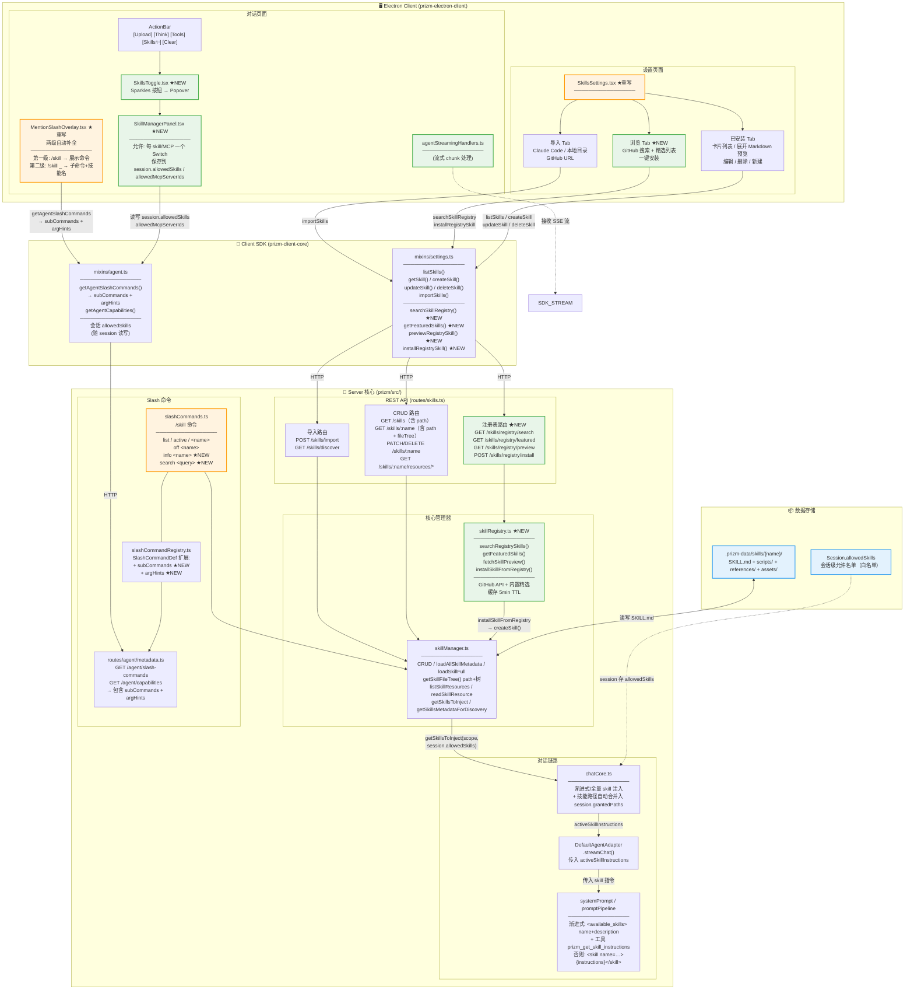
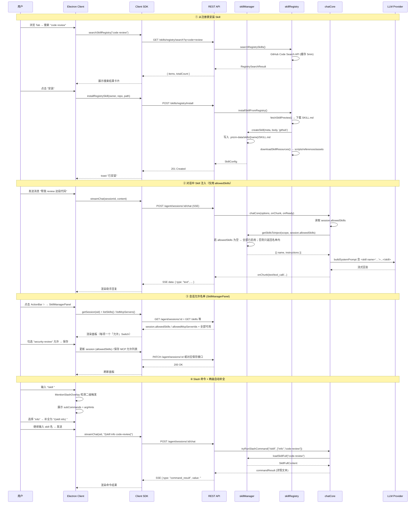

# Skill 模块全链路架构图

## 关键数据流

## 技能路径、文件树与自动授权

- **path**：`SkillConfig` / `SkillFullContent` 均含 `path`（技能目录绝对路径）。GET `/skills`、GET `/skills/:name` 响应中均包含。
- **fileTree**：`getSkillFileTree(name)` 返回技能目录下树形结构（SKILL.md + scripts/references/assets 及嵌套）。GET `/skills/:name` 响应中增加 `fileTree` 字段；`prizm_get_skill_instructions` 工具结果中也会附带 path 与 fileTree 摘要，便于模型用 prizm_file 访问资源。
- **自动授权**：chatCore 在每次对话前，将当前会话允许的技能（`session.allowedSkills` 或全部已启用）对应的目录 path 合并入 `session.grantedPaths` 并持久化，使 prizm_file 等工具无需用户单独授权即可访问技能下 scripts/references/assets。

## 文件清单

| 类型 | 文件路径 | 状态 |
|------|----------|------|
| 核心管理器 | `prizm/src/llm/skillManager.ts` | 已有 |
| 注册表 | `prizm/src/llm/skillRegistry.ts` | **新建** |
| API 路由 | `prizm/src/routes/skills.ts` | 修改 |
| Slash 命令 | `prizm/src/llm/slashCommands.ts` | 修改 |
| 命令注册表 | `prizm/src/llm/slashCommandRegistry.ts` | 修改 |
| 系统提示 | `prizm/src/llm/systemPrompt.ts` | 已有 |
| 对话核心 | `prizm/src/routes/agent/chatCore/chatCore.ts` | 修改 |
| 对话核心类型 | `prizm/src/routes/agent/chatCore/types.ts` | 修改 |
| SSE 路由 | `prizm/src/routes/agent/chat.ts` | 修改 |
| 元数据路由 | `prizm/src/routes/agent/metadata.ts` | 修改 |
| SDK 设置 | `prizm-client-core/src/http/mixins/settings.ts` | 修改 |
| SDK 代理 | `prizm-client-core/src/http/mixins/agent.ts` | 修改 |
| 设置 UI | `prizm-electron-client/src/components/SkillsSettings.tsx` | **重写** |
| 对话面板 | `prizm-electron-client/src/components/agent/SkillManagerPanel.tsx` | **新建** |
| ActionBar 按钮 | `prizm-electron-client/src/features/ChatInput/ActionBar/SkillsToggle.tsx` | **新建** |
| ActionBar 配置 | `prizm-electron-client/src/features/ChatInput/ActionBar/config.ts` | 修改 |
| ActionBar 注册 | `prizm-electron-client/src/features/ChatInput/ActionBar/index.tsx` | 修改 |
| 自动补全 | `prizm-electron-client/src/features/ChatInput/MentionSlashOverlay.tsx` | **重写** |
| 输入状态类型 | `prizm-electron-client/src/features/ChatInput/store/initialState.ts` | 修改 |
| 流处理 | `prizm-electron-client/src/store/agentStreamingHandlers.ts` | 修改 |
| 页面配置 | `prizm-electron-client/src/views/AgentPage.tsx` | 修改 |
| 页面配置 | `prizm-electron-client/src/views/CollaborationPage.tsx` | 修改 |
| 页面配置 | `prizm-electron-client/src/components/collaboration/AgentPane.tsx` | 修改 |
